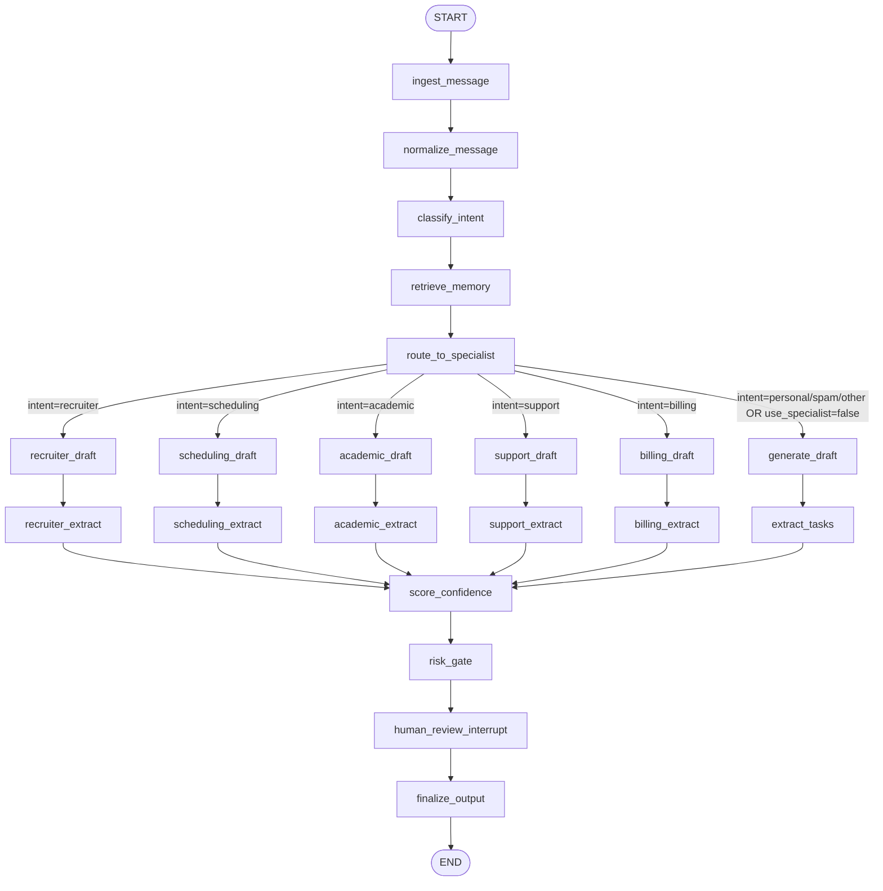
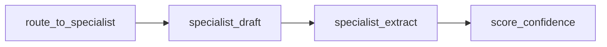
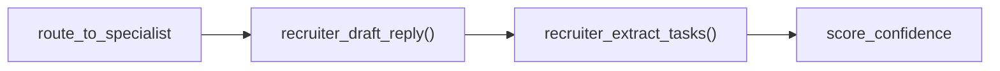
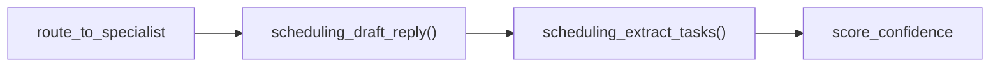
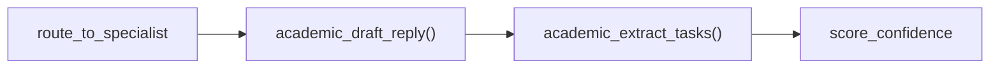
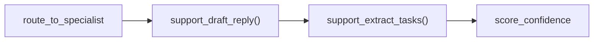
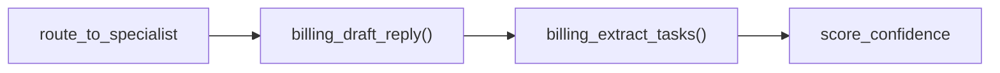
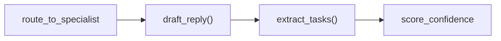
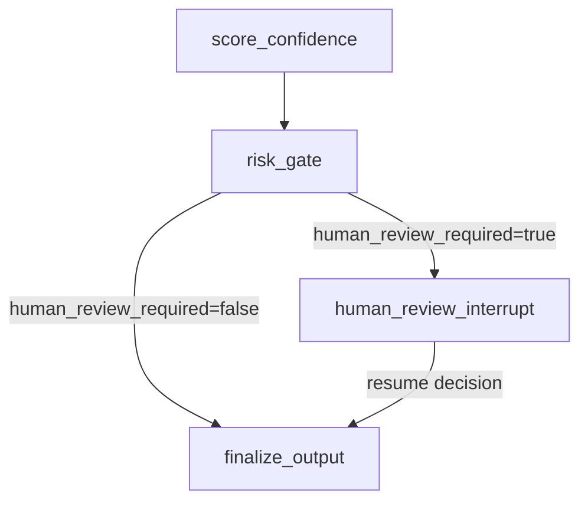
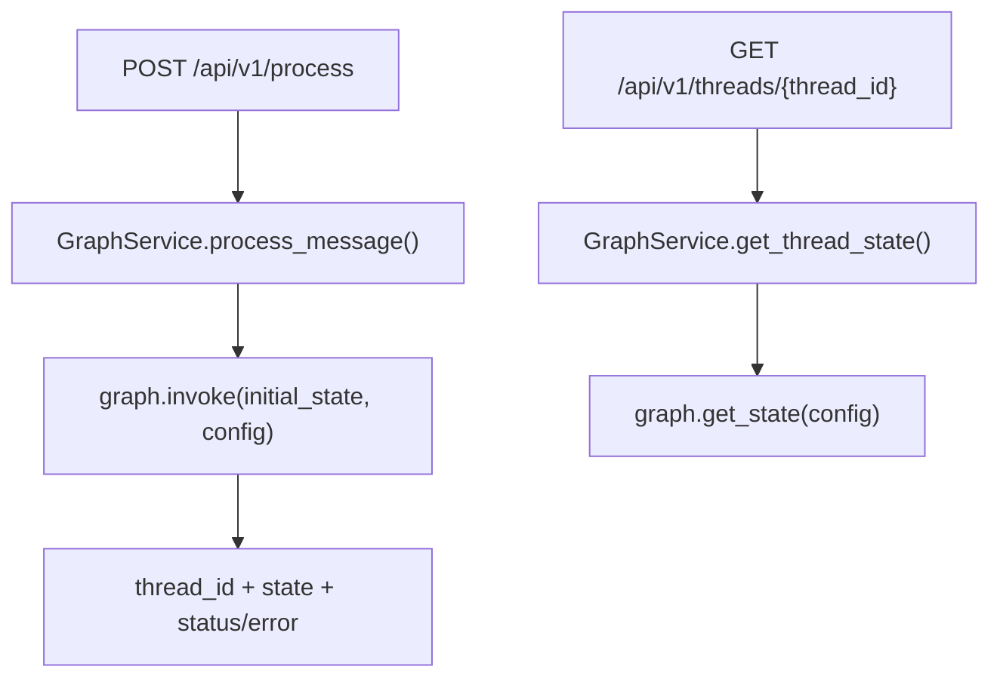

# InboxPilot State Graphs

This document shows how state flows through the system:

- Main LangGraph workflow
- Specialist branches
- General fallback branch
- API entrypoints that invoke/read graph state

## Main Workflow Graph

## Specialist Agent Paths

Each specialist path has the same shape inside the main graph:

### Recruiter Agent

### Scheduling Agent

### Academic Agent

### Support Agent

### Billing Agent

## General (Non-Specialist) Fallback Path

This path is used when:

- `use_specialist == false`, or
- classified intent is not one of `recruiter|scheduling|academic|support|billing`.

## Review Gate Behavior

## API to Graph Interaction

