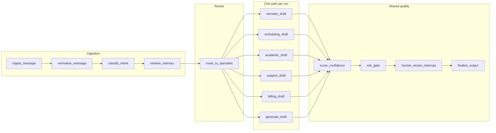

# Multi-agent workflow (InboxPilot)

This document describes how **router + specialist agents** are implemented in the backend and how they relate to the product roadmap.

## Model: not a council

The app does **not** use a multi-agent debate or council pattern. It uses:

1. **Classification** — `classify_intent` in [`backend/app/graphs/main_graph.py`](../backend/app/graphs/main_graph.py) assigns an intent (recruiter, scheduling, academic, support, billing, personal, spam).
2. **Routing** — After `retrieve_memory`, conditional edges from `route_to_specialist` choose **one** path: five specialist draft nodes or the general `generate_draft` node (`route_after_classify`).
3. **Specialist paths** — Each domain runs **draft → extract** (see [`backend/app/graphs/specialists/`](../backend/app/graphs/specialists/)), then merges into shared **score_confidence → risk_gate → human_review_interrupt → finalize_output**.
4. **General path** — `generate_draft` → `extract_tasks` (generic nodes in `main_graph.py`), then the same shared tail.

When `use_specialist` is set to `false` on the request (see `POST /api/v1/process`), routing always uses the general draft and extract nodes so benchmarks and A/B tests can compare against specialist routing.

## Execution entrypoints

| Piece | Location |
|-------|----------|
| State schema | [`backend/app/graphs/state.py`](../backend/app/graphs/state.py) |
| Graph build | [`backend/app/graphs/main_graph.py`](../backend/app/graphs/main_graph.py) `create_graph` |
| Invoke | [`backend/app/services/graph_service.py`](../backend/app/services/graph_service.py) `GraphService.process_message` |
| HTTP API | `POST /api/v1/process` in [`backend/app/api/v1/process.py`](../backend/app/api/v1/process.py) |
| Benchmarks | [`backend/app/services/benchmarking.py`](../backend/app/services/benchmarking.py) |

## Roadmap (from README)

- **Milestone 6** — Real integrations (e.g. Gmail) feeding the same graph; production-like testing.
- **Milestone 7** — Productization and scale.

## Optional future work

- Wrap each specialist in a LangGraph **subgraph** for reuse and clearer per-domain branching.
- Add **tools / RAG** (calendar, CRM, retrieval) inside specialist nodes.
- **Critic or second-pass** refinement before `score_confidence`.
